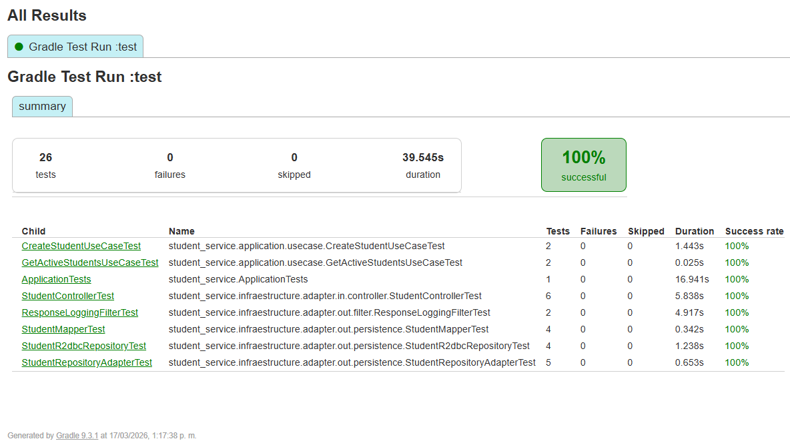
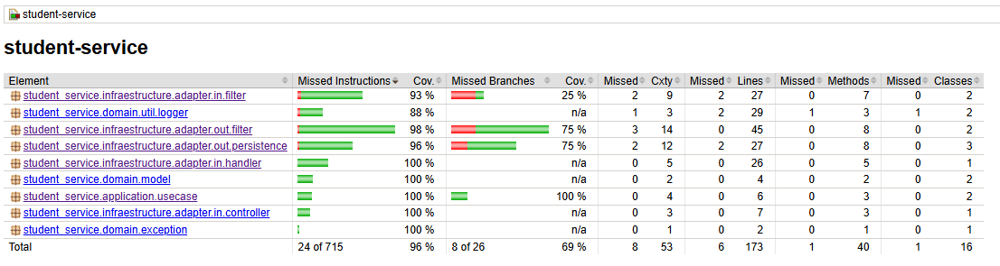
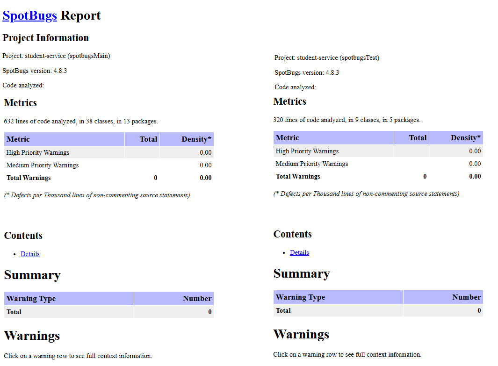
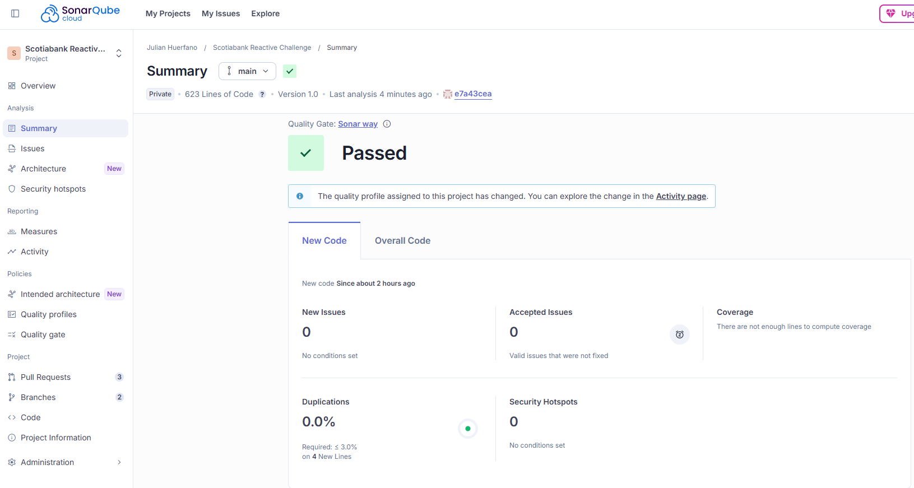
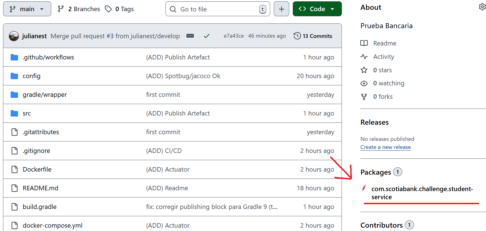
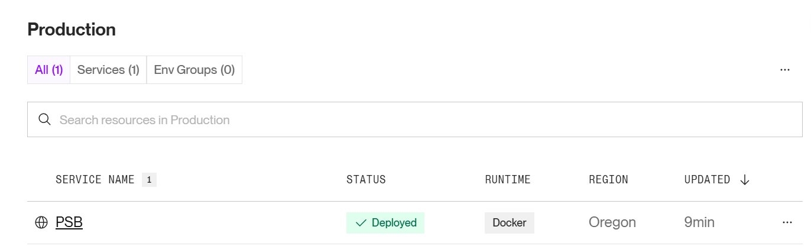
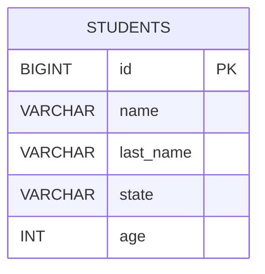
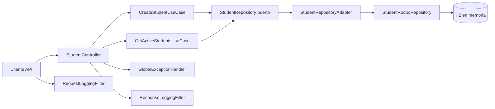

# Student Service

## Proyecto = Scotiabank Reactive Challenge

Microservicio backend reactivo para el reto Scotiabank Reactive Challenge.

- Proyecto Gradle: student-service
- Group: com.scotiabank.challenge
- Version: 0.0.1-SNAPSHOT
- Clase principal: student_service.Application
- Java: 17 (toolchain)
- Estilo: Spring WebFlux + R2DBC (sin bloqueo)

## Stack tecnológico

- Java 17
- Spring Boot 3.4.1
- Spring WebFlux
- Spring Data R2DBC
- H2 en memoria (R2DBC + JDBC para consola)
- Bean Validation
- Spring Boot Actuator (health)
- OpenAPI/Swagger con springdoc-openapi-starter-webflux-ui 2.7.0
- MapStruct + Lombok

## Arquitectura implementada

Se mantiene una arquitectura limpia pragmatica por capas:

- domain: modelo, puertos y excepciones de negocio.
- application: casos de uso reactivos.
- infraestructure: adapters de entrada/salida, persistencia, handlers y filtros.

Implementacion actual de la HU-001:

- Crear alumno: validacion de datos + validacion de id duplicado.
- Listar alumnos activos: filtrado por estado ACTIVE.
- Manejo de errores centralizado con GlobalExceptionHandler (400, 409 y 500 controlado).
- Logging canonico de request/response con filtros reactivos.

## API HTTP

Base URL:

- Local: http://localhost:8080
- Deployed (Render): https://psb-uka6.onrender.com

Base path negocio: /v1/api/students

- POST /v1/api/students
  - Crea un alumno.
  - Respuestas esperadas: 201, 400, 409, 500.

- GET /v1/api/students/active
  - Lista alumnos con estado ACTIVE.
  - Respuestas esperadas: 200, 500.

Endpoints de observabilidad (Actuator):

- GET /actuator/health
  - Verifica estado de salud del servicio (healthcheck de runtime/CI).
  - Respuesta esperada: 200.

### Resumen de endpoints

| Metodo | Endpoint | Descripcion | Respuestas |
| --- | --- | --- | --- |
| POST | /v1/api/students | Crea alumno con validaciones y control de id duplicado | 201, 400, 409, 500 |
| GET | /v1/api/students/active | Lista alumnos activos | 200, 500 |
| GET | /actuator/health | Estado de salud del servicio para monitoreo/healthcheck | 200 |

## Persistencia y configuracion

- Base en memoria: studentdb.
- Script de esquema: src/main/resources/schema.sql.
- Inicializacion de esquema activa por spring.sql.init.mode=always.
- H2 Console solo en modo demo (ver nota en seccion de herramientas).

## Calidad, cobertura y analisis estatico

- JaCoCo 0.8.11 con reporte XML/HTML.
- Regla de cobertura minima global: 80% (jacocoTestCoverageVerification).
- Exclusion de paquetes tecnicos para metrica de cobertura (config, dto, entity, mapper, Application).
- SonarCloud configurado con scanner CLI via GitHub Actions:
  - Archivo: sonar-project.properties
  - sonar.projectKey=bank-test
  - sonar.host.url=https://sonarcloud.io
  - Ejecucion con SONAR_TOKEN en Repository Secrets.
- SpotBugs activo con filtro en config/spotbugs-exclude.xml.

## CI/CD en GitHub Actions

Workflow principal:

- Archivo: .github/workflows/ci.yml
- Triggers: push (main, develop, feature/**, hotfix/**) y pull_request (main, develop)
- Orden de validaciones:
  - build
  - test + jacoco
  - spotbugs
  - sonar
  - quality-gate
  - artifact (solo en main, despues de sonar + quality-gate)

Mapa resumido del flujo:

```text
build ──┬── test ──────────────┬── sonar ──────────┐
  │                      │                    ├── artifact (solo main)
  └── spotbugs ──────────┴── quality-gate ────┘
```

Comportamiento de artefactos:

- GitHub Actions Artifact:
  - Se publica `build/libs/student-service-*.jar` como artifact descargable del run.
  - Como descargarlo:
    1. Ir a la pestana Actions del repositorio.
    2. Abrir la ejecucion del workflow en main.
    3. En la seccion Artifacts descargar `student-service-jar`.
  - Como ejecutarlo:
    - `java -jar student-service-0.0.1-SNAPSHOT.jar`
- GitHub Packages (Maven):
  - En rama main tambien se ejecuta `./gradlew publish`.
  - Se publica el paquete en el registro Maven del repositorio.
  - URL de registro Maven del repo:
    - `https://maven.pkg.github.com/julianest/PSB`

## Reglas de validacion Sonar (Quality Gate recomendado)

Reglas generales recomendadas para aprobar analisis en SonarCloud:

- New Bugs: 0
- New Vulnerabilities: 0
- New Security Hotspots Reviewed: 100%
- Coverage on New Code: >= 80%
- Duplicated Lines on New Code: <= 3%
- Maintainability Rating on New Code: A
- Reliability Rating on New Code: A
- Security Rating on New Code: A

Donde se configura:

- Alcance de analisis y exclusiones del scanner: `sonar-project.properties`.
- Definicion del Quality Gate (umbrales y condiciones): interfaz de SonarCloud.
  - Ruta: Project Settings -> Quality Gate / Quality Profiles.
- En CI, el reporte se ejecuta con scanner CLI y usa `SONAR_TOKEN` desde Repository Secrets.

Compatibilidad de Actions:

- El workflow usa versiones actualizadas de acciones para compatibilidad con Node.js 24.

## Pruebas

Cobertura de pruebas por capas presente:

- Controller: contrato HTTP, validaciones y errores.
- Use cases: reglas de negocio para creacion y consulta de activos.
- Repository/adapter: persistencia reactiva, mapeo y filtro por estado.
- Filtro de salida: cobertura de ramas writeAndFlushWith y setComplete.

Estado verificado en esta revision:

- 34 pruebas ejecutadas en reporte Gradle :test.
- 0 fallos.
- 0 omitidas.
- 100% exitosas.

## Comandos utiles

```bash
# Windows
gradlew.bat test
gradlew.bat jacocoTestReport
gradlew.bat check
gradlew.bat spotbugsMain spotbugsTest
gradlew.bat bootJar
gradlew.bat publish

# Linux/macOS
./gradlew test
./gradlew jacocoTestReport
./gradlew check
./gradlew spotbugsMain spotbugsTest
./gradlew bootJar
./gradlew publish
```

## Enlaces de reportes y herramientas

### Reportes locales generados

- Gradle test report: [build/reports/tests/test/index.html](build/reports/tests/test/index.html)
- JaCoCo HTML: [build/reports/jacoco/test/html/index.html](build/reports/jacoco/test/html/index.html)
- JaCoCo XML: [build/reports/jacoco/test/jacocoTestReport.xml](build/reports/jacoco/test/jacocoTestReport.xml)
- SpotBugs main: [build/reports/spotbugs/main.html](build/reports/spotbugs/main.html)
- SpotBugs test: [build/reports/spotbugs/test.html](build/reports/spotbugs/test.html)
- SonarCloud (analisis Remoto): [https://sonarcloud.io/summary/new_code?id=bank-test&branch=main](https://sonarcloud.io/summary/new_code?id=bank-test&branch=main)
  Nota: este enlace requiere autenticación y permisos del administrador de este proyecto.
- Artifact generado en CI (descarga): Actions -> workflow run -> Artifacts -> student-service-jar.
- Package publicado (Maven): GitHub repo -> pestaña Packages.

### Resumen Reportes

#### Gradle test

#### Jacoco Coverage

#### SpotBugs

#### Sonar Cloud

#### Artifact CI- Package Maven

#### Render Deploy


### Consolas y documentación runtime

- Local:
  - Swagger UI: [http://localhost:8080/swagger-ui.html](http://localhost:8080/swagger-ui.html)
  - OpenAPI JSON: [http://localhost:8080/v3/api-docs](http://localhost:8080/v3/api-docs)
  - Healthcheck: [http://localhost:8080/actuator/health](http://localhost:8080/actuator/health)
  - H2 Console: [http://localhost:8080/h2-console](http://localhost:8080/h2-console)
- Deployed (Render):
  - Swagger UI: [https://psb-uka6.onrender.com/swagger-ui.html](https://psb-uka6.onrender.com/swagger-ui.html)
  - OpenAPI JSON: [https://psb-uka6.onrender.com/v3/api-docs](https://psb-uka6.onrender.com/v3/api-docs)
  - Healthcheck: [https://psb-uka6.onrender.com/actuator/health](https://psb-uka6.onrender.com/actuator/health)

### Nota importante para H2 Console

Para exponer la consola H2 en este proyecto, se debe descomentar en [build.gradle](build.gradle) la linea:

implementation 'org.springframework.boot:spring-boot-starter-web'

Esta dependencia se mantiene comentada porque levanta Tomcat (stack bloqueante), lo cual rompe la consistencia de una arquitectura 100% reactiva con WebFlux.

## Cuadro resumen de reportes

| Fuente | Ruta/URL | Resultado resumido |
| --- | --- | --- |
| Gradle Test Report | [build/reports/tests/test/index.html](build/reports/tests/test/index.html) | 26 tests, 0 failures, 0 skipped, success rate 100%, duration 31.494s |
| JaCoCo Report | [build/reports/jacoco/test/jacocoTestReport.xml](build/reports/jacoco/test/jacocoTestReport.xml) | Lineas: 167/173 = 96.53%. Instrucciones: 691/715 = 96.64%. Branches: 18/26 = 69.23% |
| SpotBugs Main | [build/reports/spotbugs/main.html](build/reports/spotbugs/main.html) | 632 lineas analizadas, 38 clases, 13 paquetes, 0 warnings |
| SonarCloud | [https://sonarcloud.io/summary/new_code?id=bank-test&branch=main](https://sonarcloud.io/summary/new_code?id=bank-test&branch=main) | Analisis remoto de calidad, seguridad y deuda tecnica en rama main |
| Swagger/OpenAPI (Local) | [http://localhost:8080/swagger-ui.html](http://localhost:8080/swagger-ui.html) | UI disponible en runtime local para probar contratos y esquemas |
| Swagger/OpenAPI (Deployed) | [https://psb-uka6.onrender.com/swagger-ui.html](https://psb-uka6.onrender.com/swagger-ui.html) | UI disponible en entorno desplegado Render |
| H2 Console (Local) | [http://localhost:8080/h2-console](http://localhost:8080/h2-console) | Requiere descomentar spring-boot-starter-web para habilitar acceso web |

## Matriz de trazabilidad del challenge

| Criterio del reto | Implementacion en el proyecto | Evidencia |
| --- | --- | --- |
| Crear alumno de forma reactiva | Endpoint POST con WebFlux y caso de uso CreateStudentUseCase | API HTTP + pruebas de controller/use case |
| Rechazar id duplicado | Validacion existsById + error funcional 409 | GlobalExceptionHandler + pruebas de conflicto |
| Listar alumnos activos | Endpoint GET que filtra por estado ACTIVE | GetActiveStudentsUseCase + pruebas |
| Control de errores no contemplados | Handler global con respuesta 500 estandarizada | GlobalExceptionHandler + pruebas de manejo de errores |
| Persistencia en memoria | H2 + R2DBC + schema.sql | Configuracion + pruebas de repositorio |
| Pruebas por capa | Tests de controller, use case, repository/adapter y filtro | build/reports/tests/test/index.html |
| Calidad tecnica | JaCoCo, SpotBugs, SonarCloud y gate de cobertura | Reportes locales + SonarCloud |

## Coleccion Postman

- Colección: [src/main/resources/P-SB.postman_collection.json](src/main/resources/P-SB.postman_collection.json)
- Endpoints incluidos:
  - Crear alumno (POST /v1/api/students)
  - Listar alumnos activos (GET /v1/api/students/active)
  - Health check health = (GET /actuator/health)
- Variables:
  - Base URL: (configurada para localhost y Render) 
    - `{{8080}}`  = http://localhost:8080/
    - `{{RenderDeploy}}` = https://psb-uka6.onrender.com/
- Folders:
  - Local = En local con base URL localhost.
  - Deployed = En entorno Render con base URL deploy.
- Idempotency-Key incluido en headers para trazabilidad de logs.

## Mapa de carpetas

```text
student-service/
|- build.gradle
|- README.md
|- docs/
|  \- HU-001-gestion-alumnos-reactivo.md
|- src/
|  |- main/
|  |  |- java/student_service/
|  |  |  |- application/usecase/
|  |  |  |- config/
|  |  |  |- domain/
|  |  |  \- infraestructure/adapter/
|  |  \- resources/
|  |     |- application.properties
|  |     |- schema.sql
|  |     \- P-SB.postman_collection.json
|  \- test/java/student_service/
|     |- application/usecase/
|     \- infraestructure/adapter/
\- config/
   \- spotbugs-exclude.xml
```

## Modelo entidad-relacion



## Modelo de flujo



## Filtros de auditoria y verificacion

Funcionalidad implementada:

- RequestLoggingFilter:
  - Lee el header Idempotency-Key.
  - Si no llega, genera un UUID y lo propaga en el contexto reactivo.
  - Registra entrada canonica (IN) con trazabilidad, operacion y payload.
- ResponseLoggingFilter:
  - Intercepta writeWith, writeAndFlushWith y setComplete.
  - Reutiliza el mismo identificador de trazabilidad.
  - Registra salida canonica (OUT), codigo HTTP y detalle de error cuando aplica.

Alcance del Idempotency-Key en la implementacion actual:

- Se usa para correlacion y trazabilidad de logs de entrada/salida.
- implementa idempotencia de negocio solo como log para no afectar el modelo de la prueba.
- El formato de los eventos sigue un modelo canonico de logs como simulacion de revision de arquitectura BIAN en entornos bancarios.

Ejemplo de log de entrada (IN):

```json
{
  "id": "0f8fad5b-d9cb-469f-a165-70867728950e",
  "domainNameService": "SCOTIABANK",
  "domainNameUnity": "PERU",
  "domainNameBusiness": "DIGITAL FACTORY",
  "operation": "/v1/api/students",
  "type": "IN",
  "trace": "SUCCESS",
  "responseCode": 200,
  "data": {
    "id": 1,
    "name": "Julian",
    "lastName": "Hurtado",
    "state": "ACTIVE",
    "age": 28
  }
}
```

Ejemplo de log de salida (OUT exito):

```json
{
  "id": "0f8fad5b-d9cb-469f-a165-70867728950e",
  "domainNameService": "SCOTIABANK",
  "domainNameUnity": "PERU",
  "domainNameBusiness": "DIGITAL FACTORY",
  "operation": "/v1/api/students",
  "type": "OUT",
  "trace": "SUCCESS",
  "responseCode": 201,
  "data": {
    "responseCode": 201,
    "description": "Alumno creado exitosamente."
  }
}
```

Ejemplo de log de salida (OUT error):

```json
{
  "id": "0f8fad5b-d9cb-469f-a165-70867728950e",
  "domainNameService": "SCOTIABANK",
  "domainNameUnity": "PERU",
  "domainNameBusiness": "DIGITAL FACTORY",
  "operation": "/v1/api/students",
  "type": "OUT",
  "trace": "ERROR",
  "responseCode": 409,
  "error": {
    "code": 409,
    "type": "ERROR",
    "description": "No se pudo realizar la grabacion: el alumno con id 1 ya existe."
  },
  "data": {
    "status": 409,
    "message": "No se pudo realizar la grabacion: el alumno con id 1 ya existe."
  }
}
```

Ejemplo de respuesta HTTP 500 controlada:

```json
{
  "timestamp": "2026-03-17T21:45:12",
  "status": 500,
  "error": "Error interno",
  "message": "Ocurrio un error inesperado. Intenta nuevamente o contacta al administrador."
}
```

## Convenciones funcionales clave

- Estados permitidos para entrada: ACTIVE, INACTIVE.
- Mensaje funcional para id duplicado: error de conflicto sin exponer detalles internos.
- Se evita uso de block() y llamadas bloqueantes equivalentes.

## Demo rapida (3 minutos)

1. Levantar servicio:

```bash
gradlew.bat bootRun
```

2. Crear alumno:

```bash
# Local
curl -X POST "http://localhost:8080/v1/api/students" \
  -H "Content-Type: application/json" \
  -H "Idempotency-Key: demo-001" \
  -d "{\"id\":1,\"name\":\"Julian\",\"lastName\":\"Hurtado\",\"state\":\"ACTIVE\",\"age\":28}"

# Deployed
curl -X POST "https://psb-uka6.onrender.com/v1/api/students" \
  -H "Content-Type: application/json" \
  -H "Idempotency-Key: demo-001" \
  -d "{\"id\":1,\"name\":\"Julian\",\"lastName\":\"Hurtado\",\"state\":\"ACTIVE\",\"age\":28}"
```

3. Forzar duplicado para ver 409:

```bash
# Local
curl -X POST "http://localhost:8080/v1/api/students" \
  -H "Content-Type: application/json" \
  -H "Idempotency-Key: demo-002" \
  -d "{\"id\":1,\"name\":\"Julian\",\"lastName\":\"Hurtado\",\"state\":\"ACTIVE\",\"age\":28}"

# Deployed
curl -X POST "https://psb-uka6.onrender.com/v1/api/students" \
  -H "Content-Type: application/json" \
  -H "Idempotency-Key: demo-002" \
  -d "{\"id\":1,\"name\":\"Julian\",\"lastName\":\"Hurtado\",\"state\":\"ACTIVE\",\"age\":28}"
```

4. Consultar activos:

```bash
# Local
curl "http://localhost:8080/v1/api/students/active" -H "Idempotency-Key: demo-003"

# Deployed
curl "https://psb-uka6.onrender.com/v1/api/students/active" -H "Idempotency-Key: demo-003"
```

5. Verificar observabilidad con Actuator:

```bash
# Local
curl "http://localhost:8080/actuator/health"

# Deployed
curl "https://psb-uka6.onrender.com/actuator/health"
```

6. Revisar Swagger, reportes y calidad:

- Local Swagger: http://localhost:8080/swagger-ui.html
- Deployed Swagger: https://psb-uka6.onrender.com/swagger-ui.html
- build/reports/tests/test/index.html
- build/reports/jacoco/test/html/index.html
- build/reports/spotbugs/main.html
- https://sonarcloud.io/summary/new_code?id=bank-test&branch=main

7. Descargar y ejecutar artefacto generado en CI (main):

- Ir a Actions -> workflow run -> Artifacts -> `student-service-jar`.
- Descargar el ZIP y extraer el JAR.
- Ejecutar:

```bash
java -jar student-service-0.0.1-SNAPSHOT.jar
```

## Supuestos y limitaciones

- Persistencia en memoria orientada a challenge/demo, no a entorno productivo.
- Flujo de duplicados basado en existsById + insert (posible carrera en concurrencia alta).
- Idempotency-Key enfocado en trazabilidad, no en deduplicacion funcional.
- H2 Console requiere habilitacion explicita de dependencia bloqueante para demo local.

## Decisiones técnicas y trade-offs

- Se priorizo stack reactivo puro (WebFlux + R2DBC) sobre herramientas bloqueantes.
- Se centralizo manejo de errores en GlobalExceptionHandler para contratos HTTP consistentes.
- Se uso logging canonico para observabilidad completa de IN/OUT.
- Se mantuvo arquitectura por capas para separar dominio, aplicacion e infraestructura.

## Próximos pasos recomendados

- Mapear error de clave duplicada de base a 409 para robustez en concurrencia.
- Unificar Idempotency-Key en Postman usando header en todos los endpoints.
- Agregar truncado/limites de payload en filtros de logging para evitar picos de memoria.
